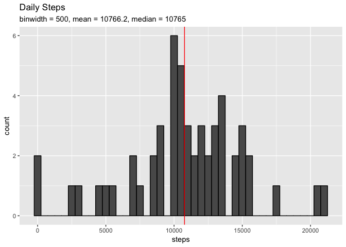
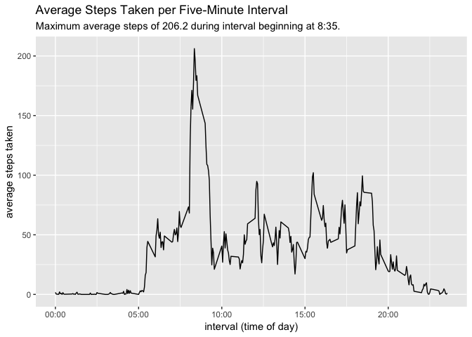
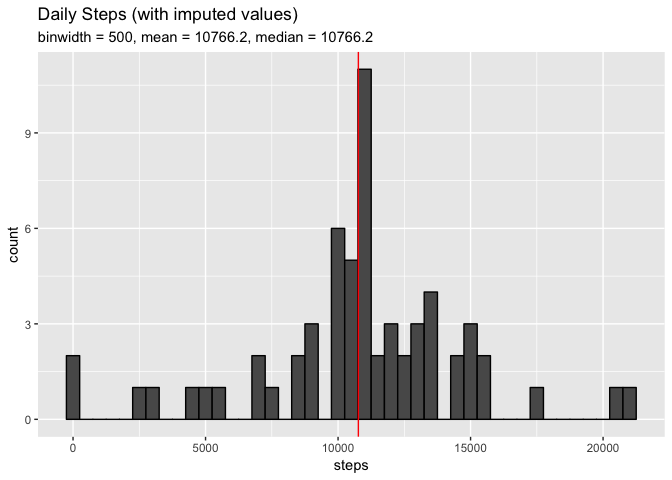
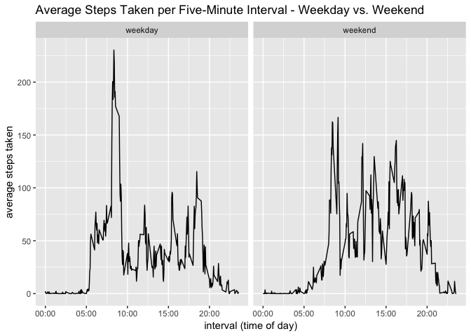

## Loading and preprocessing the data

```r
library(lubridate)
library(ggplot2)
library(plyr)
activity <- read.csv("activity.csv")
activity$date <- as_date(activity$date)
```

## What is mean total number of steps taken per day?

```r
dropNA <- subset(activity, !is.na(activity$steps))
daily <- ddply(dropNA, .(date), summarize, total_steps=sum(steps))
meanSteps <- mean(daily$total_steps)
medSteps <- median(daily$total_steps)
g <- ggplot(daily, aes(total_steps))
g <- g + geom_histogram(binwidth=500, color="black")
g <- g + geom_vline(xintercept = meanSteps, color="red")
g <- g + ggtitle("Daily Steps", 
            subtitle = paste("binwidth = 500, mean = ", 
                             round(meanSteps, 1),
                             ", median = ", 
                             medSteps, sep=""))
g + xlab("steps")
```

<!-- -->


## What is the average daily activity pattern?

```r
dropNA <- subset(activity, !is.na(activity$steps))
byInterval <- ddply(dropNA, .(interval), summarize, mean_steps=mean(steps))
m <- max(byInterval$mean_steps)
mt <- byInterval$interval[which(byInterval$mean_steps == m)]
g <- ggplot(byInterval, aes(interval, mean_steps))
g <- g + geom_line()
g <- g + ggtitle("Average Steps Taken per Five-Minute Interval",
                 subtitle=paste("Maximum average steps of ",
                                round(m, 1), " during interval beginning at ",
                                substr(mt, 1, nchar(mt) - 2),
                                ":",
                                substr(mt, nchar(mt) - 1, nchar(mt)),
                                ".",
                                sep=""))
g <- g + xlab("interval (time of day)")
g <- g + ylab("average steps taken")
g + scale_x_continuous(breaks=c(0,500,1000,1500,2000),
                       labels=c("00:00","05:00","10:00","15:00","20:00"))
```

<!-- -->


## Imputing missing values


```r
naCount <- sum(is.na(activity$steps))
imputed <- activity
i <- 1
while (i <= nrow(imputed)) {
  if (is.na(imputed$steps[i])) {
    matching <- which(byInterval$interval == imputed$interval[i])
    imputed$steps[i] <- byInterval[matching, 2]
  }
  i <- i + 1
}
dailyImputed <- ddply(imputed, .(date), summarize, total_steps=sum(steps))
meanSteps <- mean(dailyImputed$total_steps)
medSteps <- median(dailyImputed$total_steps)
g <- ggplot(dailyImputed, aes(total_steps))
g <- g + geom_histogram(binwidth=500, color="black")
g <- g + geom_vline(xintercept = meanSteps, color="red")
g <- g + ggtitle("Daily Steps (with imputed values)", 
            subtitle = paste("binwidth = 500, mean = ", 
                             round(meanSteps, 1),
                             ", median = ", 
                             round(medSteps, 1),
                             sep=""))
g + xlab("steps")
```

<!-- -->

The data set contains 2304 missing values in the `steps` variable. Imputing the missing 
values with the mean step value of the corresponding time interval results in a change to the 
distribution of values in the histogram but little change in the mean and median values of total
steps per day.

## Are there differences in activity patterns between weekdays and weekends?


```r
imputed$dayType <- ifelse(weekdays(imputed$date) %in% c("Saturday", "Sunday"), 
         "weekend", "weekday")
imputed$dayType <- as.factor(imputed$dayType)
byType <- ddply(imputed, .(interval, dayType), summarize, mean_steps=mean(steps))
g <- ggplot(byType, aes(interval, mean_steps))
g <- g + geom_line()
g <- g + ggtitle("Average Steps Taken per Five-Minute Interval - Weekday vs. Weekend")
g <- g + xlab("interval (time of day)")
g <- g + ylab("average steps taken")
g <- g + scale_x_continuous(breaks=c(0,500,1000,1500,2000),
                       labels=c("00:00","05:00","10:00","15:00","20:00"))
g + facet_wrap(vars(dayType))
```

<!-- -->
